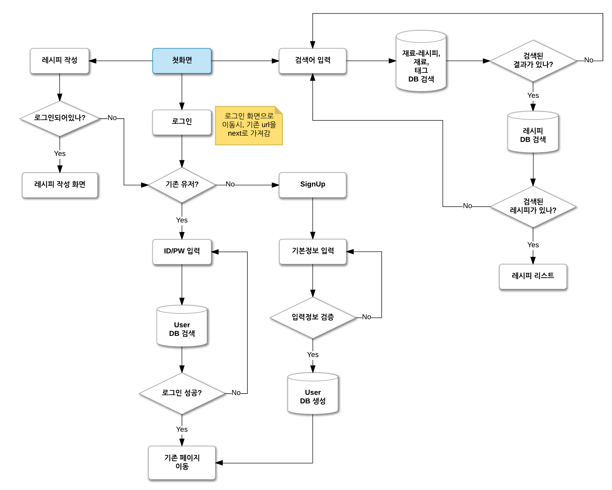
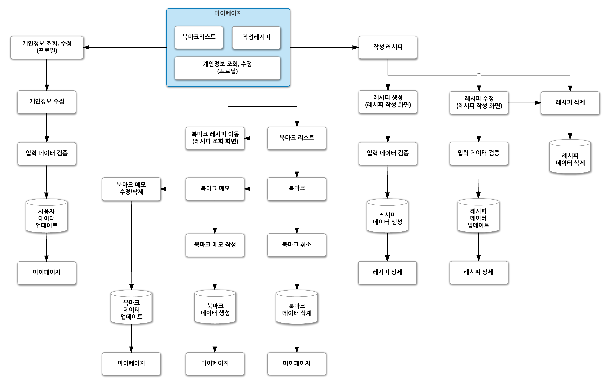
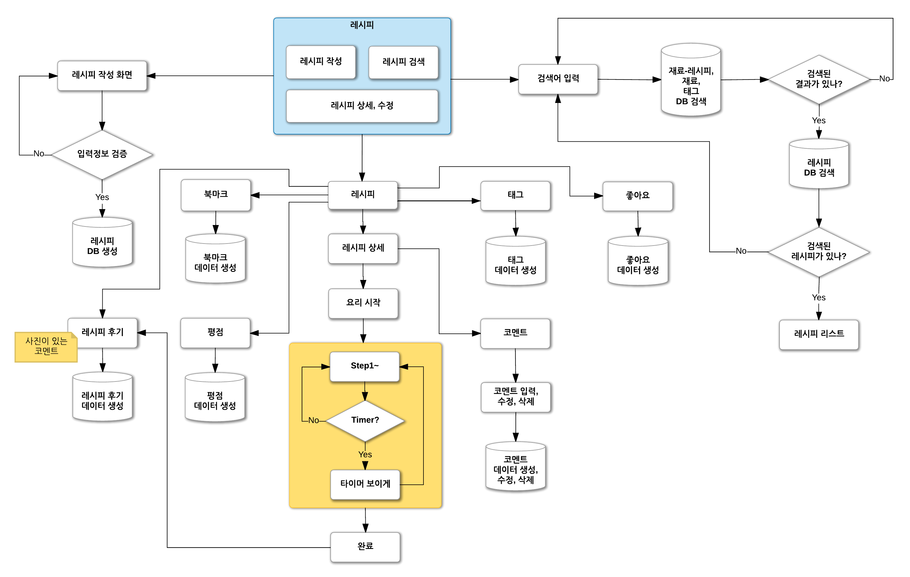
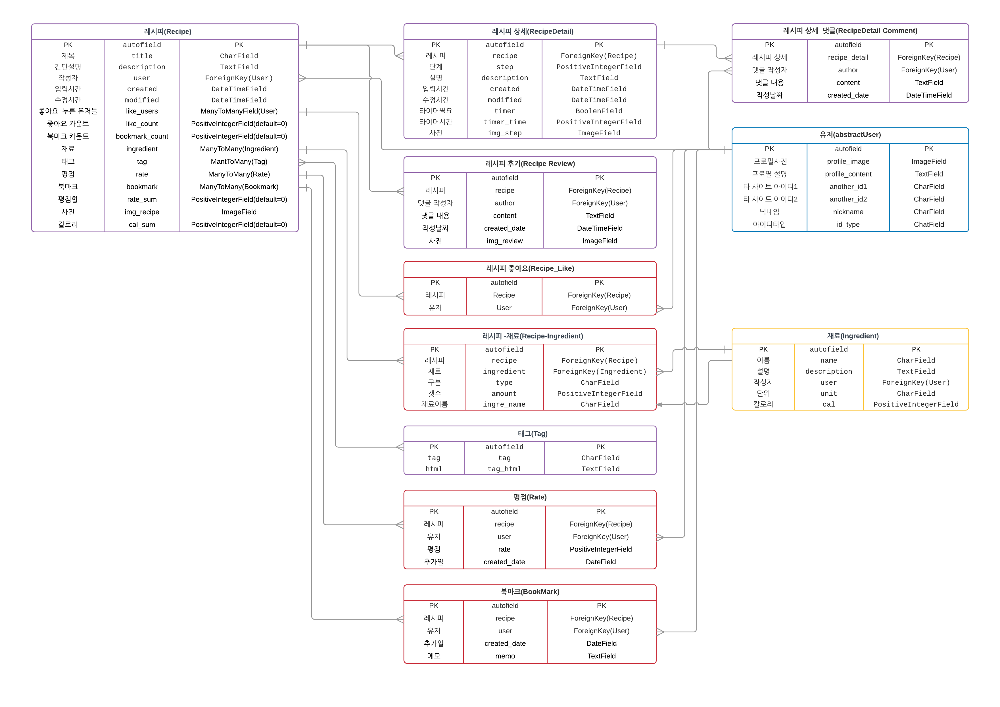

# Picky Cookbook (작업 중)

### Fast Campus Web Programming School 5기

### 홍동현, 조동희, 이승연

### 사용 stack

- Django
- Python
- Django Rest-framework
- AWS Elastic Beanstalk
- AWS S3
- AWS RDS
- Docker
- Postgresql
- Git
- Gitbook ([API 문서 - 작성 중](https://recordingbetter.gitbooks.io/picky-cookbook-api/content/))

## 목표

1. 지금 냉장고 안에 있는 재료로
2. 당장 할 수 있는 요리를 찾아서 
3. 해먹는다.

## 세부 목표

1. 재료, 태그, 레시피 이름으로 검색할 수 있다.
2. 회원가입, 로그인을 할 수 있다. (SNS)
3. 사용자가 레시피를 작성할 수 있다.
4. 레시피에 북마크, 평점, 좋아요를 할 수 있다.
5. 북마크한 레시피에 나만의 메모를 작성할 수 있다.
6. 레시피의 요리 단계 별로 코멘트 작성이 가능하다.
7. 요리 단계 별로 상세 설명과 필요할 경우 타이머를 제공한다.
8. 요리 단계가 완료되면 후기를 작성할 수 있다.
9. 마이페이지에서 작성한 레시피, 북마크 메모, 개인정보를 조회, 수정, 삭제할 수 있다.

## Scenario

  

  

  
## Database Modeling

